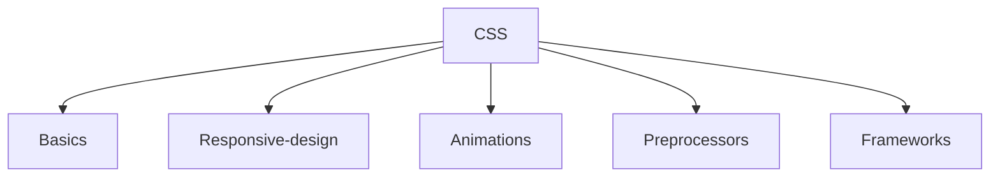

## Basics

<a href="https://www.youtube.com/watch?v=x4q86IjJFag">1 - Chrome dev tools</a>

<a href="https://www.youtube.com/watch?v=M6coJNLFBWI">2 - Box model</a>

<a href="https://www.youtube.com/watch?v=LrdkRMZhgZg">3 - Float</a>

<a href="https://www.youtube.com/watch?v=6G42rXal5-g&list=PLu0W_9lII9agiCUZYRsvtGTXdxkzPyItg&index=21">4 - Clear</a>

<a href="https://www.youtube.com/watch?v=x_i2gga-sYg">5 - Display property</a>

<a href="https://www.youtube.com/watch?v=MwGHiVl-gqk&list=PLu0W_9lII9agiCUZYRsvtGTXdxkzPyItg&index=25">6 - Positioning</a>

<a href="https://www.youtube.com/watch?v=Uzuq2FGxgK4&list=PLu0W_9lII9agiCUZYRsvtGTXdxkzPyItg&index=27">7 - Visibility and z-index</a>

<a href="https://www.youtube.com/watch?v=oPPym7UaSIo&list=PLu0W_9lII9agiCUZYRsvtGTXdxkzPyItg&index=15">8 - Selectors I</a>

<a href="https://www.youtube.com/watch?v=WwUM7qOimbo&list=PLu0W_9lII9agiCUZYRsvtGTXdxkzPyItg&index=31">9 - Selectors II</a>

<a href="https://www.youtube.com/watch?v=P-hZDC5YkJE&list=PLu0W_9lII9agiCUZYRsvtGTXdxkzPyItg&index=32">10 - Pseudo selectors</a>

<a href="https://www.youtube.com/watch?v=PlKG1fooswU&list=PLu0W_9lII9agiCUZYRsvtGTXdxkzPyItg&index=33">11 - Before and after selectors</a>

<a href="https://www.youtube.com/watch?v=ASNldCkFBcM&list=PLu0W_9lII9agiCUZYRsvtGTXdxkzPyItg&index=34">12 - Box shadow and text shadow</a>

<a href="https://www.youtube.com/watch?v=ghlm_94oR90&list=PLu0W_9lII9agiCUZYRsvtGTXdxkzPyItg&index=35">13 - Variables</a>

<a href="https://www.youtube.com/watch?v=xx_pJ2ouGnc">14 - Outline vs border</a>

<a href="https://www.youtube.com/watch?v=e_kdWMmD3z0">15 - Color Theory</a>

## Responsive-design

<a href="https://www.youtube.com/watch?v=DVjrb52C5Gs&list=PLu0W_9lII9agiCUZYRsvtGTXdxkzPyItg&index=30">1 - Em, rem, vh and vw</a>

<a href="https://www.youtube.com/watch?v=WTz4A8IdeEQ&list=PLu0W_9lII9agiCUZYRsvtGTXdxkzPyItg&index=31">2 - Media queries</a>

<a href="https://www.youtube.com/watch?v=MPl9bevckUE&list=PLu0W_9lII9agiCUZYRsvtGTXdxkzPyItg&index=40">3 - CSS Grid I</a>

<a href="https://www.youtube.com/watch?v=Aec0xLKzBWk&list=PLu0W_9lII9agiCUZYRsvtGTXdxkzPyItg&index=41">4 - CSS Grid II</a>

<a href="https://www.youtube.com/watch?v=5II60I5gpKY&list=PLu0W_9lII9agiCUZYRsvtGTXdxkzPyItg&index=42">5 - CSS Grid III</a>

<a href="https://www.youtube.com/watch?v=QAv7TsE18QM&list=PLu0W_9lII9agiCUZYRsvtGTXdxkzPyItg&index=43">6 - CSS Grid IV</a>

<a href="https://www.youtube.com/watch?v=JBupsN9Cmrs&list=PLu0W_9lII9agiCUZYRsvtGTXdxkzPyItg&index=44">7 - CSS Grid V</a>

<a href="https://www.youtube.com/watch?v=mu0qTVIkkAs&list=PLu0W_9lII9agiCUZYRsvtGTXdxkzPyItg&index=45">8 - Media queries with CSS Grid</a>

<a href="https://www.youtube.com/watch?v=CC2HkBZuReY">9 - Build layouts with CSS Grid</a>

<a href="https://www.youtube.com/watch?v=VQraviuwbzU">10 - Tips to create responsive layouts</a>

<a href="https://www.youtube.com/watch?v=5qVuORLniwM">11 - Flexbox I</a>

<a href="https://www.youtube.com/watch?v=u044iM9xsWU">12 - Flexbox II</a>

## Animations

<a href="https://www.youtube.com/watch?v=jiK6Mf-ILSg&list=PLu0W_9lII9agiCUZYRsvtGTXdxkzPyItg&index=36">1 - Animations and keyframes</a>

<a href="https://www.youtube.com/watch?v=k4Dr0PJKidI&list=PLu0W_9lII9agiCUZYRsvtGTXdxkzPyItg&index=37">2 - Transitions</a>

<a href="https://www.youtube.com/watch?v=K0Gz7CKNJzY&list=PLu0W_9lII9agiCUZYRsvtGTXdxkzPyItg&index=38">3 - Transform</a>

## Preprocessors

<a href="https://www.youtube.com/watch?v=nu5mdN2JIwM&list=PLRlbDmjayb7aMt0y8wX6tDT2HVBja2-af&index=1">SASS crash course</a>

## Frameworks

<a href="https://www.youtube.com/watch?v=vpAJ0s5S2t0&t=4003s">Bootstrap crash course</a>

<a href="https://www.youtube.com/watch?v=vyJU9efvUtQ">Material-UI crash course</a>

<a href="https://www.youtube.com/watch?v=zT62eVxShsY">ReactJS + MUI form</a>
